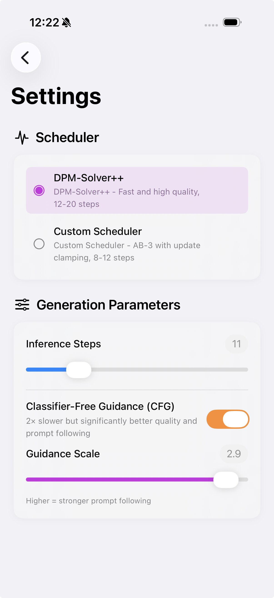

# Mobile-O Demo on iPhone 17:

<table>
  <tr>
    <th align="center" style="font-size:16px;">🖼️ Image Generation</th>
    <th align="center" style="font-size:16px;">👁️ Image Understanding</th>
    <th align="center" style="font-size:16px;">✏️ Image Editing</th>
  </tr>
  <tr>
    <td align="center" valign="top">
      <div style="padding-top:8px;">
        
      </div>
    </td>
    <td align="center" valign="top">
      <div style="padding-top:8px;">
        
      </div>
    </td>
    <td align="center" valign="top">
      <div style="padding-top:8px;">
        
      </div>
    </td>
  </tr>
</table>

# Mobile-O App: Advanced Generation Control Settings


# Capabilities

- **Text → Text** (General conversational AI)
- **Image → Text** (Image Understanding)
- **Text → Image** (Image Generation)
- **Text + Image → Image** (Image Editing)


This folder contains the iOS application and an optional model export pipeline (PyTorch to CoreML/MLX).

---

## Folder Structure

```
mobile-o/
├── export.py                  # (Optional) Exports PyTorch model to on-device formats
├── requirements.txt           # Python dependencies for export
├── mobileo/                   # Python model definitions (used by export.py)
│   ├── constants.py
│   └── model/                 # MobileOForInferenceLM and sub-components
└── app/                       # iOS Xcode project
    ├── MobileO.xcodeproj
    ├── Configuration/         # Build config (xcconfig)
    └── MobileO/               # Swift source code
        ├── App/               # App entry point and root view
        ├── Models/            # Swift model wrappers (Generation, Understanding, Chat)
        ├── Services/          # Model download manager and network monitor
        ├── ViewModels/        # Chat and settings view models
        ├── Views/             # SwiftUI views
        ├── Video/             # Camera support
        ├── Utilities/         # Helpers and extensions
        └── Resources/         # Config files (scheduler, preprocessor)
```

---

## Quick Start (Recommended)

The app **automatically downloads all required models** on first launch — no manual export or setup is needed.

### Prerequisites

- **macOS** with **Xcode 16+**
- A **physical iPhone 15 or later** (the Simulator is not supported)

### Build and Run

1. Open the Xcode project:
   ```bash
   open app/MobileO.xcodeproj
   ```
2. Connect your **iPhone 15 or later**
3. Set your **Development Team** in Signing & Capabilities
4. **Build and run**: `Cmd + R`

### First Launch: Automatic Model Download

On first launch, the app will present a download screen before you can use it:

1. The app checks whether models are already present on-device
2. If not, a **permission screen** shows the download details (~3.6 GB download, ~5 GB disk space required)
3. Tap **"Download Models"** to begin — downloads run in the background via `URLSession` and can continue even if the app is backgrounded
4. You can **pause and resume** at any time; progress is saved automatically
5. After downloading, the app **compiles** the CoreML models on-device (this may take a few minutes)
6. Once complete, tap **"Get Started"** to enter the app

Models are downloaded from HuggingFace ([`Amshaker/Mobile-O-0.5B-iOS`](https://huggingface.co/Amshaker/Mobile-O-0.5B-iOS)) and stored in the app's Application Support directory. After the one-time setup, the app runs **fully offline**.

> **Note:** A WiFi connection is recommended. The app will warn you if you are on cellular data but will not block the download.

---

## Advanced: Manual Model Export (Optional)

If you prefer to export models yourself (e.g., with custom quantization settings), you can use the `export.py` script to convert the PyTorch checkpoint into on-device components.

### Prerequisites

- **Python 3.10+**
- **macOS** (required for CoreML export)

### Set Up the Python Environment

```bash
# Clone the repository
git clone https://github.com/<org>/mobile-o.git
cd mobile-o

# Create a virtual environment (recommended)
python3 -m venv venv
source venv/bin/activate

# Install dependencies
pip install -r requirements.txt
```

### Export the Models

The `export.py` script converts the PyTorch checkpoint into 5 on-device components:

| Component | Format | Output File |
|-----------|--------|-------------|
| DiT Transformer | CoreML FP32 | `transformer.mlpackage` |
| VAE Decoder | CoreML FP32 | `vae_decoder.mlpackage` |
| Connector | CoreML FP32 | `connector.mlpackage` |
| Vision Encoder | CoreML FP16 | `vision_encoder.mlpackage` |
| LLM (Qwen2) | MLX 4-bit | `llm/` (weights, config, tokenizer files) |

```bash
# Downloads from HuggingFace automatically
python export.py

# Or use a local checkpoint
python export.py --model /path/to/mobileo-checkpoint
```

This creates an `exported_models/` directory with all 5 components.

### Export specific components only

```bash
# Export just the DiT and VAE
python export.py --only dit vae

# Export just the LLM with 8-bit quantization instead of 4-bit
python export.py --only llm --llm-bits 8
```

### Full usage

```
python export.py [--model MODEL] [--output-dir DIR] [--only COMPONENT...] [--llm-bits {4,8,16,32}]
```

| Argument | Default | Description |
|----------|---------|-------------|
| `--model` | `Amshaker/Mobile-O-0.5B` | HuggingFace model ID or local path |
| `--output-dir` | `exported_models` | Where to save exported models |
| `--only` | all | Space-separated list: `dit`, `vae`, `connector`, `vision`, `llm` |
| `--llm-bits` | `4` | LLM quantization: 4, 8, 16, or 32 bits |

### Copy Exported Models into the App

Copy all exported models into the app's Resources folder:

```bash
cp -r exported_models/*.mlpackage app/MobileO/Resources/
mkdir -p app/MobileO/Resources/llm
cp -r exported_models/llm/* app/MobileO/Resources/llm/
```

Then follow the **Build and Run** steps from the Quick Start section above.

> **Note:** Mobile-O requires iPhone 15 or later and must be run on a physical device. The iOS Simulator does not support the CoreML and Metal features used by the app.

---

## How It Works

The app uses a chat-based interface. What happens depends on your input:

| Input | What happens |
|-------|-------------|
| `generate <prompt>` | Generates an image from the text prompt |
| `edit <prompt>` + attached image | Edits the attached image based on the text instruction |
| Text prompt + attached image (no prefix) | Analyzes the image and responds with a text response based on the text prompt|
| Text only (no prefix) | Regular text chat using the language model |

## Acknowledgements
The image understanding component of this application is built on top of [FastVLM](https://github.com/apple/ml-fastvlm/tree/main). We sincerely thank all the contributors for their valuable efforts and contributions.
