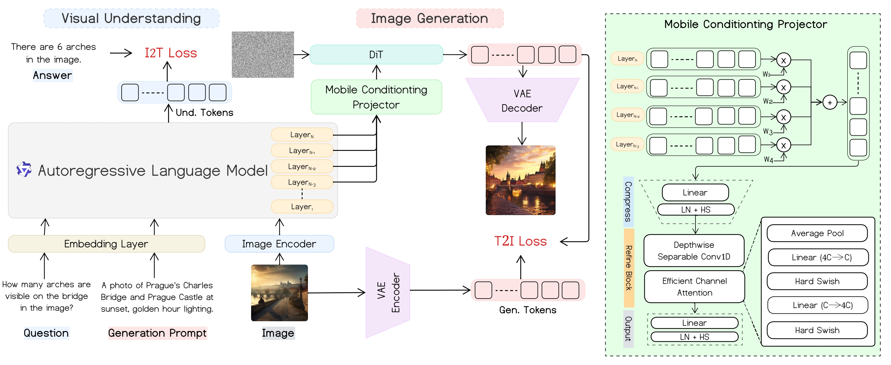
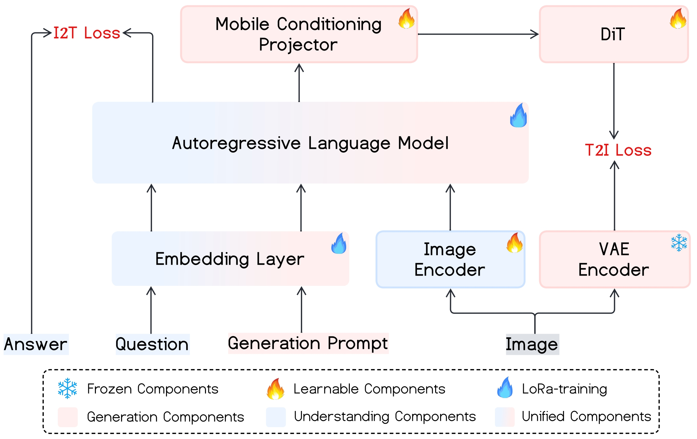
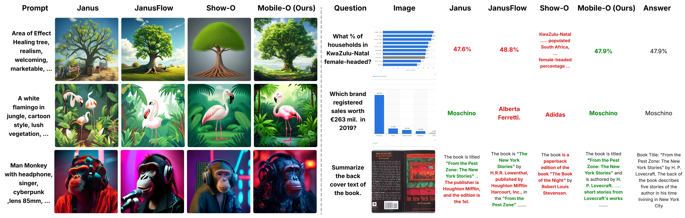
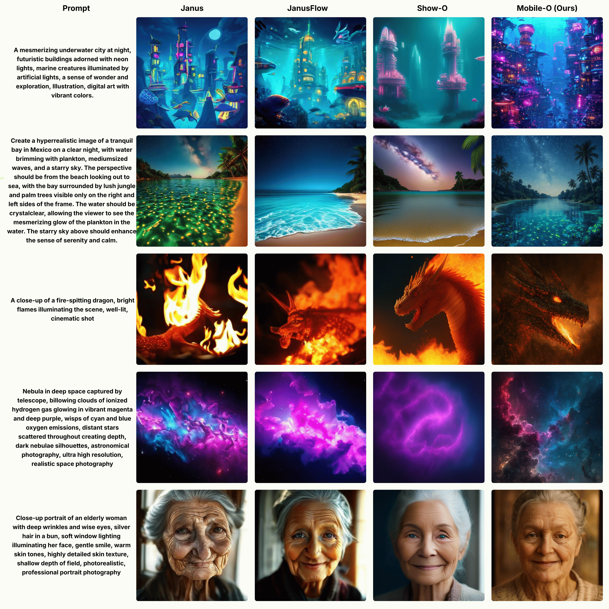
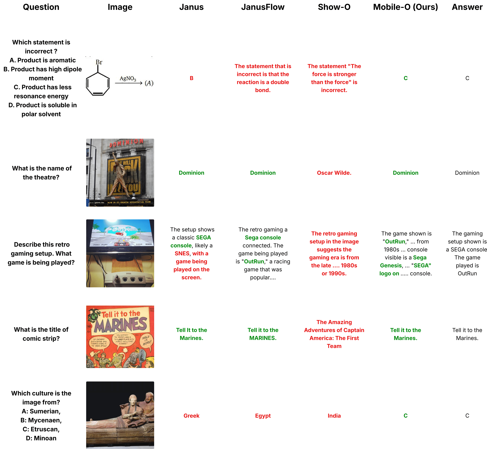

<div align="center">

<h1 align="center">
   Mobile-O: Unified Multimodal Understanding and Generation on Mobile Device
</h1>

<p>
<a href="https://arxiv.org/abs/2602.20161"></a>
<a href="https://mobileo.cvmbzuai.com/"></a>
<a href="https://amshaker.github.io/Mobile-O/"></a>
<a href="https://huggingface.co/collections/Amshaker/mobile-o-models"></a>
<a href="https://huggingface.co/collections/Amshaker/mobile-o-datasets"></a>
<a href="https://apps.apple.com/app/mobile-o/id6759238106"></a>

</p>


**[Abdelrahman Shaker](https://amshaker.github.io)<sup>1,∗,†</sup>, [Ahmed Heakl](https://ahmedheakl.github.io/)<sup>1,∗</sup>, [Jaseel Muhammad](https://www.linkedin.com/in/jaseelmkk)<sup>1</sup>,<br> [Ritesh Thawkar](https://scholar.google.com/citations?user=9-2AnjQAAAAJ&hl=en)<sup>1</sup>, [Omkar Thawakar](https://omkarthawakar.github.io/)<sup>1</sup>, [Senmao Li](https://scholar.google.com/citations?user=F96SDKwAAAAJ&hl=en)<sup>1</sup>, [Hisham Cholakkal](https://scholar.google.com/citations?user=bZ3YBRcAAAAJ&hl=en)<sup>1</sup>,<br>  [Ian Reid](https://scholar.google.com/citations?user=ATkNLcQAAAAJ&hl=en)<sup>1</sup>, [Eric P. Xing](https://scholar.google.com/citations?user=5pKTRxEAAAAJ&hl=en)<sup>1,2</sup>, [Salman Khan](https://scholar.google.com/citations?user=M59O9lkAAAAJ&hl=en)<sup>1,†</sup>, [Fahad Shahbaz Khan](https://scholar.google.es/citations?user=zvaeYnUAAAAJ)<sup>1,3,†</sup>**


<sup>1</sup>Mohamed bin Zayed University of Artificial Intelligence &nbsp; <sup>2</sup>Carnegie Mellon University &nbsp; <sup>3</sup>Linköping University

<em><small>*Equal Contributions &nbsp; †Project Leaders</small></em>

---

</div>

## 📣 Announcement


- **Mobile-O** is now fully released! This includes models, training and evaluation code, inference scripts, paper, and the complete mobile app.

---
## 📌 Overview

Mobile-O is a compact, efficient unified vision–language–diffusion model that performs both **multimodal understanding** (VQA, OCR, reasoning) and **image generation** within a single architecture, while running entirely on-device. It is designed specifically for mobile and edge deployment, achieving real-time performance with a small memory footprint.

<p align="center">
  
</p>

## 🧠 Model Capabilities
<table>
  <tr>
    <th align="center">🖼️ Image Generation</th>
    <th align="center">👁️ Image Understanding</th>
    <th align="center">✏️ Image Editing</th>
  </tr>
  <tr>
    <td align="center"></td>
    <td align="center"></td>
    <td align="center"></td>
  </tr>
</table>

---

## 🏗️ Architecture

<p align="center">
  
  <br>
  <em>Overall architecture of Mobile-O: a unified vision–language–diffusion model for on-device multimodal understanding and generation.</em>
</p>

Mobile-O consists of three main components:

- **Vision-Language Model (VLM):** A compact multimodal backbone based on FastVLM, combining a FastViT-based vision encoder with a lightweight autoregressive language model (Qwen2-0.5B) for efficient visual–text understanding.

- **Diffusion Decoder:** A lightweight DiT-style diffusion transformer based on SANA, paired with a VAE encoder–decoder, designed for 512×512 text-to-image generation under mobile constraints.

- **Mobile Conditioning Projector (MCP):** A novel lightweight connector (~2.4M params) that bridges the VLM and diffusion decoder using layerwise feature fusion with temperature-scaled learnable weights, depthwise-separable 1D convolutions, and efficient channel attention. Unlike query-token approaches, MCP directly conditions the diffusion model on weighted VLM hidden states with minimal overhead.

---

## 🎯 Supported Tasks

| Task | Input | Output | Description |
|------|-------|--------|-------------|
| 💬 Text → Text | Text | Text | General conversational AI |
| 👁️ Image → Text | Image + Text | Text | Image understanding (VQA, OCR, reasoning) |
| 🖼️ Text → Image | Text | Image | High-quality image generation at 512×512 |
| ✏️ Text + Image → Image | Image + Text | Image | Instruction-based image editing |
| 🔄 Unified Training | Mixed | Mixed | Joint image generation and understanding |

---
## 📱 Mobile App

Mobile-O runs entirely on-device with no cloud dependency. We release the **full source code** of the iOS app along with optimized **MLX** and **CoreML** model components. The app runs smoothly on **iPhone 15 Pro**, **iPhone 16 Pro**, and **iPhone 17 Pro** ✅.

<p align="center">
  <a href="https://apps.apple.com/app/mobile-o/id6759238106">
    
  </a>
</p>

<table align="center">
  <tr>
    <td>📱 <b>iOS App Source Code</b></td>
    <td><a href="./Mobile-O-App/">Mobile-O-App</a></td>
  </tr>
  <tr>
    <td>🧩 <b>MLX & CoreML Models</b></td>
    <td><a href="https://huggingface.co/Amshaker/Mobile-O-0.5B-iOS">🤗 HuggingFace</a></td>
  </tr>
</table>

<p align="center">
  ⚡ <b>~3-4s</b> Image Generation &nbsp;&nbsp;•&nbsp;&nbsp; 👁️ <b>~0.4s</b> Visual Understanding &nbsp;&nbsp;•&nbsp;&nbsp; 💾 <b>< 2GB</b> Memory Footprint
</p>

---    
## 📊 Training Datasets

| Stage | Description | Download |
|-------|-------------|----------|
| **Pre-training** | 9M text-image pairs (JourneyDB+BLIP3o-Pretrain-Short-Caption) | [🤗 HuggingFace](https://huggingface.co/datasets/Amshaker/Mobile-O-Pre-Train) |
| **SFT** | ~105K curated prompt-image pairs | [🤗 HuggingFace](https://huggingface.co/datasets/Amshaker/Mobile-O-SFT) |
| **Post-training** | ~105K unified quadruplet samples | [🤗 HuggingFace](https://huggingface.co/datasets/Amshaker/Mobile-O-Post-Train) |
---

## ⚙️ Setup

```bash
conda create -n mobileo python=3.12 -y
conda activate mobileo
pip install -r requirements.txt
```

---

## 🚀 Inference

### Download Checkpoint

```bash
python -c "from huggingface_hub import snapshot_download; print(snapshot_download(repo_id='Amshaker/Mobile-O-0.5B', repo_type='model', local_dir='checkpoints', allow_patterns=['final_merged_model_23620/*']))"
```

### 1. Image Understanding

```bash
python infer_und.py \
    --model_path /HF_model/checkpoint/path/ \
    --image_path assets/cute_cat.png \
    --prompt "What is in the image?"
```

### 2. Image Generation

```bash
python infer_gen.py \
    --model_path /HF_model/checkpoint/path/ \
    --prompt "A vibrant tropical rainforest scene with a scarlet macaw perched on a moss-covered branch"
```

### 3. Image Editing

```bash
python infer_edit.py \
    --model_path /HF_model/checkpoint/path/ \
    --image_path assets/cute_cat.png \
    --prompt "Make the cat wear a hat"
```

---

## 🏋️ Training

### Stage 1: Pretraining (Cross-Modal Alignment)

We pretrain the DiT and Mobile Conditioning Projector (MCP) components on 9M text-image pairs from [JourneyDB](https://journeydb.github.io/) (4M) and BLIP3o-Short-Caption (5M) using [data](https://huggingface.co/datasets/Amshaker/Mobile-O-Pre-Train). The visual encoders, LLM backbone, and VAE are frozen.

```bash
bash scripts/Mobile-O-0.5B/pretrain.sh
```

### Stage 2: Supervised Fine-tuning (SFT)

We finetune the DiT and MCP components on ~105K curated prompt-image pairs (60K from BLIP3o + 45K from ShareGPT-4o-Image) using [data](https://huggingface.co/datasets/Amshaker/Mobile-O-SFT). The visual encoders, LLM backbone, and VAE remain frozen.

```bash
bash scripts/Mobile-O-0.5B/sft.sh
```

### Stage 3: Unified Multimodal Post-Training

We post-train the DiT, MCP, LLM (via LoRA), and visual encoder components on ~105K quadruplet samples in the format *(generation prompt, image, question, answer)* using [data](https://huggingface.co/datasets/Amshaker/Mobile-O-Post-Train). Only the VAE remains frozen.

```bash
bash scripts/Mobile-O-0.5B/post_train.sh
```

<p align="center">
  
  <br>
  <em>Unified multimodal post-training: jointly optimizing image generation and visual understanding via a multi-task objective.</em>
</p>

### Merging LoRA Weights

Since the output of post-training is LoRA adaptor weights for the LLM, you can merge them with the base model using `merge_lora.py` to get the final merged checkpoint for inference.

```bash
python mobileo/merge_lora.py \
    --checkpoint_dir /path/to/lora_weights/ \
    --base_weights /path/to/sft_checkpoint/ \
    --output_dir /path/to/final_merged_model/
```

**Example with actual paths:**

```bash
python mobileo/merge_lora.py \
    --checkpoint_dir checkpoints/Mobile-O-0.5B-Post-Train/ \
    --base_weights checkpoints/Mobile-O-0.5B-SFT/ \
    --output_dir checkpoints/Mobile-O-0.5B-Post-Train/final_merged_model/
```

---

## 🎨 Qualitative Results


### Generation Samples:

<p align="center">
  
  <br>
</p>

### Qualitative Comparison:

<p align="center">
  
</p>

### More Generation Comparison:

<p align="center">
  
  <br>
  
</p>

### More Understanding Comparison:

<p align="center">
  
  <br>
</p>

---

## 📄 Citation

If you find Mobile-O useful in your research, please consider citing:

```bibtex
@article{shaker2026mobileo,
  title={Mobile-O: Unified Multimodal Understanding and Generation on Mobile Device},
  author={Shaker, Abdelrahman and Heakl, Ahmed and Muhammad, Jaseel and Thawkar, Ritesh and Thawakar, Omkar and Li, Senmao and Cholakkal, Hisham and Reid, Ian and Xing, Eric P. and Khan, Salman and Khan, Fahad Shahbaz},
  journal={arXiv preprint arXiv:2602.20161},
  year={2026}
}
```

---

## 🙏 Acknowledgements

This repo is partially built upon [BLIP3o](https://github.com/JiuhaiChen/BLIP3o). Thanks to all the contributors for their great efforts.

---
## 📜 License

- The **Mobile-O** models, source code, and mobile application are released exclusively for research and **non-commercial use** under the CC BY-NC-SA 4.0 license. Any commercial use is **strictly prohibited** without prior explicit written permission from the authors.
---

<div align="center">
  <a href="https://amshaker.github.io/Mobile-O/">🌐 Project Page</a> &nbsp;•&nbsp;
  <a href="https://mobileo.cvmbzuai.com/">🚀 Live Demo</a> &nbsp;•&nbsp;
  <a href="https://arxiv.org/abs/2602.20161">📄 Paper</a>
</div>
